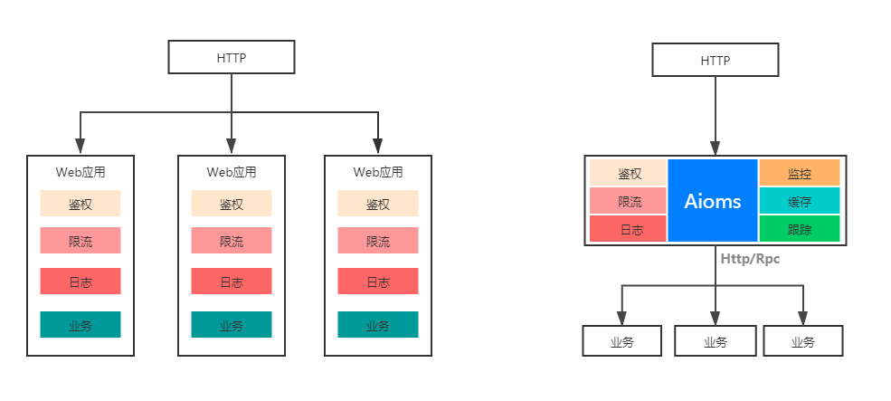

## Asyncio Micro Service Gateway Framework
基于tornado使用asyncio为核心引擎的一个微服务网关基础框架Aioms
## 概要
微服务是一种分布式系统解决方案，推动细颗粒服务的使用，这些小而自治的服务协同工作，且每个服务都有自己的生命周期。
因为微服务主要围绕业务领域建模，所以避免了由传统的分层架构引发的很多问题。但是在微服务架构下，服务拆分会让API的规模成倍增长，如何管理这些API成为了一个问题，使用API网关来管理API逐渐成为一种趋势。同时在Python语言生态并没有类似于
Java Spring Cloud这样的成熟的微服务网关框架，所以统一API网关服务Aioms就是在这种背景下应运而生，适用于目前我们业务规模且完全自研，
业务研发人员通过继承集成的方式即可对外开放功能和数据。本文将介绍统一API网关诞生的背景、关键的技术设计和实现，以及API网关未来的规划，
希望能给大家带来一些帮助或者启发。

## 一、背景介绍
* **1.1 API网关是什么**

API网关是随着微服务（Microservice）概念兴起的一种架构模式。原本一个庞大的单体应用（All in one）
业务系统被拆分成许多微服务（Microservice）系统进行独立的维护和部署，服务拆分带来的变化是API的规模
成倍增长，API的管理难度也在日益增加，使用API网关发布和管理API逐渐成为一种趋势。一般来说，
API网关是运行于外部请求与内部服务之间的一个流量入口，实现对外部请求的协议转换、鉴权、流控、参数校验、
监控等通用功能。

* **1.2 为什么要做Aioms API网关**

在没有Aioms API网关之前，业务研发人员如果要将内部服务输出为对外的HTTP API接口。通常要搭建一个Web应用，
用于完成基础的鉴权、限流、监控日志、参数校验、协议转换等工作，同时需要维护代码逻辑、基础组件的升级，
研发效率相对比较低。此外，每个Web应用都需要维护机器、配置、数据库等，资源利用率也非常差。

同时发现，在Python生态环境下并没有好的现成的解决方案，因此，Aioms API网关项目正式立项，
我们目标是提供高性能、高可用、可扩展的统一API网关解决方案，让业务研发人员可以零成本的方式即可对外开放功能和数据。

* **1.3 使用Aioms带来的好处是什么**

&emsp;&emsp;业务研发人员只需要简单继承的方式即可快速开放服务接口。

&emsp;&emsp;Aioms统一提供鉴权、限流、熔断、降级等非业务基础能力。

## 二、技术设计与实现
* **2.1 整体架构**

  
Aiosm API网关的辅助面由Aiosm管理平台和Aiosm监控中心组成，
这两部分属于后续规划中，现在只是有一简单功能供给下游业务服务使用。
管理平台主要完成API的全生命周期管理以及配置下发的工作，
监控中心完成API请求监控数据的收集和业务告警，日志记录功能。

Aiosm API网关的配置中心主要完成辅助面与业务面的信息交互，通过统一配置服务Zookeeper来实现。

Aiosm API网关的数据面也就是Aiosm服务端。一次完整的API请求，可能是从移动应用、Web应用，
合作伙伴或内部系统发起，经过Nginx负载均衡系统后，到达服务端。
服务端进行一系列的处理后路由到目标的后端RPC服务或HTTP服务，最后返回响应结果。
  
* **2.1.1 辅助面**

辅助面类似于中台概念的一个东西，目前并没有一个整体开发，只是实现了一些简单功能，
如：下游服务上传API到配置中心，访问日志的保存和记录里，使用Skywalking进行链路跟踪等。

* **2.1.2 配置中心**

使用Zookeeper作为配置中心，用于向API网关的数据面下发API的路由规则配置变更。
配置中心的设计上使用统一配置管理服务Zookeeper和本地缓存结合的方式，实现动态配置和不停机发布

* **2.1.3 数据面**

API网关的数据面在感知到API配置后，会在内存中建立请求路径与API配置的路由信息。
通常HTTP请求路径上，会包含一些路径变量，采用正则匹配的方式，进行路由的发现

* **2.2 高可用设计**

Aioms API网关作为接入层的基础组件，高可用性一直是业务研发人员非常关心的部分。
接下来，我们就来探索一下Aioms在高可用设计方面的实践。

使用python做web开发面临的一个最大的问题就是性能，
在解决C10K问题上显的有点吃力。有些异步框架Tornado、Twisted、Gevent 等就是为了解决性能问题。
这些框架在性能上有些提升，且异步框架并发性只是在IO密集型业务有优势，对于CPU密集业务优势也并不是很明显，
同时由于是使用异步函数和我们平时同步开发逻辑有些许不同，所以会出现各种古怪的问题难以解决。

在python3.6中，官方的异步协程库asyncio正式成为标准。在保留便捷性的同时对性能有了很大的提升, 
已经出现许多的异步框架使用asyncio。如Tornado，本框架就是以Tornado为基础搭建的微服务网关基础框架，正是由于Tornado在异步上的优势。
我们就以Tornado为基础，搭建微服务框架。

Aioms对API请求做了全异步化处理，请求通过Tornado IO线程异步提交到业务处理线程池，调用后端服务使用RPC或HTTP框架的异步方式，释放了由于网络等待引起的线程占用，
使线程数不再成为网关的瓶颈。

## 三、框架特性以及后续规划

* **使用tornado异步框架，简单，轻量，高效。**
* **使用asyncio为核心引擎，使tornado在很多情况下单机单进程并发甚至不亚于Golang，Java。**
* **1.0版本，微服务之间的RPC是基于redis创建的消息总线，利用消息总线进行RPC**
* **2.0版本，使用AsyncHTTPClient作为http client，使用http协议进行微服务之间的RPC。**
* **参考Java Spring Cloud，开发集成限流，熔断等功能，利用责任链模式动态接入网关，提高系统稳定性**
* **使用Zookeeper作为协调服务器，进行服务动态注册发现和下线**
* **使用skywalking为分布式追踪系统，记录微服务之间的调用链**
* **使用unittest做单元测试，并且使用mock来避免访问其他微服务。**
* **使用pydoc自动生成API文档。由于Tornado对Swagger API支持的并不是很好，后续会研究看看有什么解决方案将Swagger API接入，这样就可以把接口文档同步到接口平台上**

## 四、Usage
&emsp;&emsp;python3.7+ 环境 使用tornado为基础框架进行扩展开发

* **安装依赖包**

&emsp;&emsp;python -m pip install --upgrade pip -i https://pypi.tuna.tsinghua.edu.cn/simple

&emsp;&emsp;python -m pip install -r reqs.txt -i https://mirrors.aliyun.com/pypi/simple

&emsp;&emsp;python -m pip freeze > reqs.txt  
